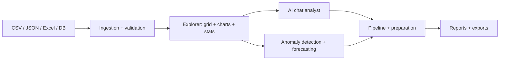

<div align="center">


[](https://github.com/abhiraj-ops/dataflow-ai-intelligence-platform/actions/workflows/ci.yml)


[](https://git.io/typing-svg)

**AI-Powered Data Intelligence Platform** — conversational analytics, real-time visualization and predictive modeling.


</div>

---

## 📖 What is this?

Upload a sales CSV, ask questions in plain English, and get charts, anomaly flags and demand forecasts back — no dashboards to build. Zero external APIs: everything runs locally on mocks.

**Bundled data story** — `india_d2c_weekly_sales.csv`: 120 weeks of grocery sales across **8 Indian metros** (Mumbai, Delhi NCR, Bengaluru, Hyderabad, Chennai, Kolkata, Pune, Ahmedabad), all values in **₹** with Indian digit grouping (`₹42,50,000`) and Cr/L abbreviations. Real-feeling seasonality (Diwali surge, wedding-season lift, monsoon lull) plus genuine demand shocks for the anomaly detector to find.

## ✨ Features

| Module | What it does |
|---|---|
| 📊 Intelligence dashboard | Data-driven INR KPIs (lifetime revenue, units, metros, conversion) + live status |
| 📥 Ingestion hub | Drag-drop CSV, JSON/JSONL, Excel, images (mock OCR), DB connectors · preview + validation badges |
| 🔍 Data explorer | Sortable/filterable grid, 4 configurable charts (bar, line, scatter, heatmap), stats + correlation matrix |
| 💬 AI chat analyst | Top-10s, trends, outliers, drivers — with confidence scores, embedded charts/tables, follow-ups |
| 🔮 Predictive analytics | 2σ anomaly detection, OLS forecasts (7/14/30-day) with confidence bands, feature ranking, seasonality |
| 🔗 Pipeline builder | Visual source → transform → enrich → analyze → export flow with per-step preview |
| 🧹 Data preparation | Regex find/replace, null strategies, outlier treatment, normalization, dedupe |
| 📤 Sharing & export | HTML reports, CSV/JSON/SQL/API-cURL exports |
| ⚙️ Settings | API keys, retention, notifications, theme, shortcuts |

## 🏗️ How it flows



## 🛠️ Tech stack


<details>
<summary><b>📁 Project structure</b></summary>

```
src/
├── components/   # Header, DataIngestion, DataExplorer, ChatInterface,
│                 # Analytics, Pipeline, Prepare, ExportPanel, Settings, Footer
├── data/         # mockDataset.ts — 120-week Indian D2C generator (seeded)
├── store/        # useStore.ts — Zustand state (rows, chat, charts, pipeline)
├── utils/        # dataProcessing, aiResponses, exportHelpers (+ tests)
├── types/        # DataRow, ChatMessage, ChartConfig, PipelineStep …
└── styles        # index.css — glassmorphism + neon system
```

</details>

<details>
<summary><b>⚡ Scripts</b></summary>

| Command | Purpose |
|---|---|
| `npm run dev` | Local dev server |
| `npm run build` | Production build → `dist/` |
| `npm run preview` | Serve the production build |
| `npm run type-check` | `tsc` |
| `npm run lint` | ESLint (zero-warning) |
| `npm test -- --run` | Vitest suite |

Node ≥ 20 required. Deploy configs included: `vercel.json` + `netlify.toml`.

</details>

## 📊 Repo stats

<div align="center">


</div>

## 📄 License

MIT © 2026 DataFlow Analytics · Bengaluru, India
